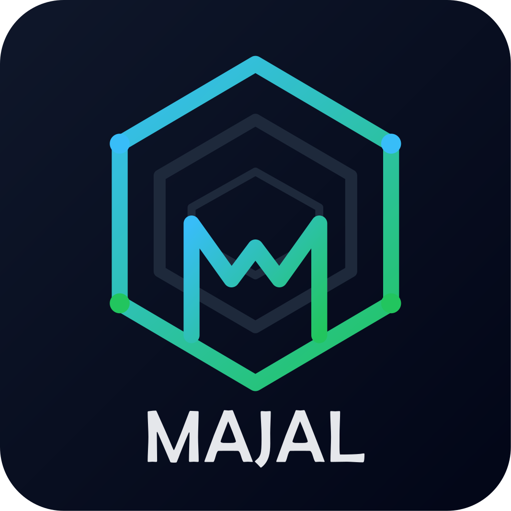

<div align="center">
    
</div>

--- 

<div align="center" style="margin-top: 20px;">

[](https://www.nuget.org/packages/Majal/)
[]()

</div>


## Overview
Majal is a **C# source generator library** that helps you implement Domain-Driven Design (DDD) patterns with minimal boilerplate. It provides source generators for:

- **Entities** (with equality and comparison helpers)
- **Aggregates** (domain events publishing)
- **Value Objects** (with equality and comparison helpers)
- **Archivables** (Soft-deletion)
- **Auditables** (Creation/Update tracking)
- **Translatables** (Multi-language support)
- **Ordinals** (Sort order)

The library ships as a Roslyn analyzer/source generator package that can be referenced from any .NET project.

## NuGet Package

```xml
<PackageReference Include="Majal" Version="<VERSION>" />
```

The package contains the generators and the required analyzer DLL (`Majal.dll`).

## Building the Project

The solution targets **.NET Standard 2.0** and can be built with the .NET CLI:

```bash
# Restore packages
dotnet restore

# Build the generators
dotnet build src/Majal/Majal.csproj -c Release
```

The generated analyzer DLL will be placed in `src/Majal/bin/Debug/netstandard2.0/` (or `Release` folder).

## Running Tests

The repository contains a test project (`Majal.Tests`). To run the unit tests:

```bash
dotnet test tests/Majal.Tests/Majal.Tests.csproj
```

## Documentation

- [Getting Started](docs/getting-started.md)
- [Aggregates Guide](docs/aggregates.md)
- [Entities Guide](docs/entities.md)
- [Value Objects Guide](docs/value-objects.md)
- [Archivables Guide](docs/archivables.md)
- [Auditables Guide](docs/auditables.md)
- [Translatables Guide](docs/translatables.md)
- [Ordinals Guide](docs/ordinals.md)
- [EF Core Integration](docs/ef-core.md)


## Contributing

Contributions are welcome! Feel free to open issues or submit pull requests.

## License
This project is licensed under the MIT License.
